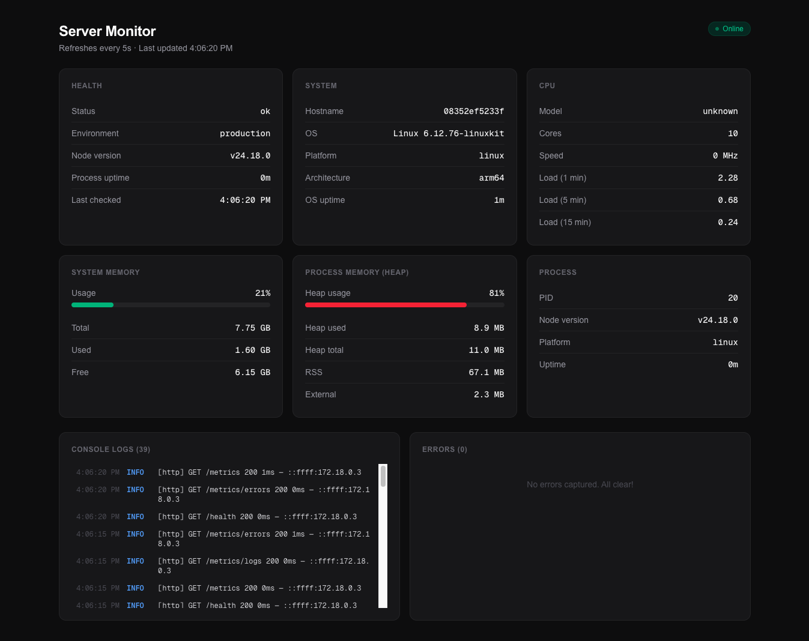
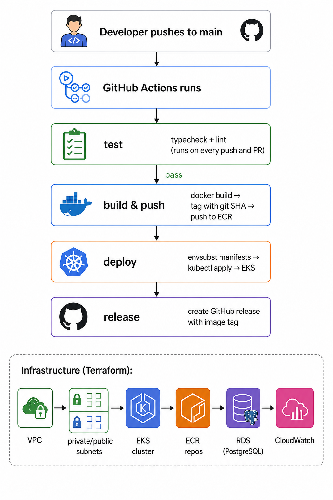

# Uptime Monitor

A simple server monitoring platform built with Next.js and Node.js, containerized with Docker, deployed to AWS EKS using Terraform and GitHub Actions.

## What It Does

The frontend shows a real-time dashboard, CPU, memory, uptime, process info, and captured logs from the backend. The backend exposes a set of API endpoints that collect and return system metrics. Everything is protected by an API key except two endpoints, one is the `/` endpoint and another is `/health` endpoint.

## Why This Project

The project is to showcase the DevOps Assessment from LogicMatrix. The tasks are mentioned in the given pdf.



## Project Structure

```
uptime-monitor/
├── uptime-monitor-frontend/    Next.js dashboard (port 3001)
├── uptime-monitor-backend/     Node.js API server (port 8080)
├── k8s/                        Kubernetes manifests
├── terraform/                  AWS infrastructure (EKS, ECR, RDS, VPC)
├── .github/workflows/          CI/CD pipeline
└── docs/                       Task documentation
```

## DevOps Flow



## Running Locally

Make sure we have Docker and Docker Compose installed.

**1. Clone the repo**

```bash
git clone <repo-url>
cd uptime-monitor
```

**2. Set up env files**

For the backend:

```bash
cp uptime-monitor-backend/.env.example uptime-monitor-backend/.env
# fill in API_KEY with anything you want for local use
```

For the frontend:

```bash
cp uptime-monitor-frontend/.env.example uptime-monitor-frontend/.env.local
# BACKEND_URL=http://localhost:8080
# API_KEY=same value as backend
```

**3. Start everything**

```bash
docker compose up -d
```

Frontend runs at `http://localhost:3001`
Backend runs at `http://localhost:8080`

**Test the backend directly:**

```bash
curl http://localhost:8080
curl http://localhost:8080/health
```

## Running in Production (AWS EKS)

These are one-time setup steps. Once done, every push to `main` deploys automatically via the pipeline.

### Step 1 - Bootstrap Terraform Remote State

Before running Terraform, create the S3 bucket and enable versioning on it. This is done once manually because Terraform can't create its own state storage.

```bash
ACCOUNT_ID=$(aws sts get-caller-identity --query Account --output text)

aws s3api create-bucket \
  --bucket "uptime-monitor-tfstate-${ACCOUNT_ID}" \
  --region ap-southeast-1 \
  --create-bucket-configuration LocationConstraint=ap-southeast-1

aws s3api put-bucket-versioning \
  --bucket "uptime-monitor-tfstate-${ACCOUNT_ID}" \
  --versioning-configuration Status=Enabled
```

Then open `terraform/provider.tf` and replace `YOUR_ACCOUNT_ID` with your actual AWS account ID as we're using Account ID to make the bucket unique. We may use another number or letter to make the bucket name unique and adjust this in terraform provider.

### Step 2 - Provision Infrastructure with Terraform

```bash
cd terraform/
terraform init
terraform plan -out=tfplan -var="db_username=admin" -var="db_password=yourpassword"
terraform apply "tfplan"
```

This creates the VPC, EKS cluster, ECR repos, RDS instance, and CloudWatch alarms in AWS.

### Step 3 - Configure kubectl

After Terraform finishes, connect kubectl to the new cluster:

```bash
aws eks update-kubeconfig --name uptime-monitor-production --region ap-southeast-1
```

### Step 4 - Install NGINX Ingress Controller

The cluster needs an ingress controller before the app can be reached from outside:

```bash
kubectl apply -f https://raw.githubusercontent.com/kubernetes/ingress-nginx/controller-v1.15.1/deploy/static/provider/aws/deploy.yaml
```

### Step 5 - Create IAM User for GitHub Actions

The IAM user needs these permissions:

- `AmazonEC2ContainerRegistryPowerUser` — to push images to ECR
- `eks:DescribeCluster` — to run `aws eks update-kubeconfig`

Create the user, generate an access key, and keep the values for the next step.

### Step 6 - Grant CI/CD IAM User Access to EKS

By default only the IAM entity that created the cluster can run kubectl commands. The GitHub Actions IAM user needs to be added to the cluster's `aws-auth` ConfigMap:

```bash
kubectl edit configmap aws-auth -n kube-system
```

Add this under `mapUsers`:

```yaml
mapUsers: |
  - userarn: arn:aws:iam::<ACCOUNT_ID>:user/<your-ci-iam-user>
    username: github-actions
    groups:
      - system:masters
```

### Step 7 - Add GitHub Secrets

Go to GitHub repo --> Settings --> Secrets and variables --> Actions:
Then add repo secrets.

| Secret                  | Value                                                                    |
| ----------------------- | ------------------------------------------------------------------------ |
| `AWS_ACCESS_KEY_ID`     | IAM user access key                                                      |
| `AWS_SECRET_ACCESS_KEY` | IAM user secret key                                                      |
| `AWS_ACCOUNT_ID`        | Your AWS account ID                                                      |
| `API_KEY`               | A strong random string (this is used to authenticate frontend → backend) |
| `MY_GITHUB_TOKEN`       | A GitHub personal access token with repo scope (for creating releases)   |

### Step 8 - Push to main

Everything is set up. Push to `main` and the pipeline will build both images, deploy to EKS, and create a GitHub release automatically.

To check if everything is running, use:

```bash
kubectl get pods -n uptime-monitor
kubectl get ingress -n uptime-monitor
```

## Tech Stack

| Layer              | Technology                           |
| ------------------ | ------------------------------------ |
| Frontend           | Next.js 16, TypeScript, Tailwind CSS |
| Backend            | Node.js 24, Express 5, TypeScript    |
| Container          | Docker, Docker Compose               |
| Registry           | AWS ECR                              |
| Orchestration      | Kubernetes (AWS EKS)                 |
| Infrastructure     | Terraform (custom modules only)      |
| CI/CD              | GitHub Actions                       |
| Monitoring         | AWS CloudWatch                       |
| Database (planned) | AWS RDS PostgreSQL (private subnet)  |
